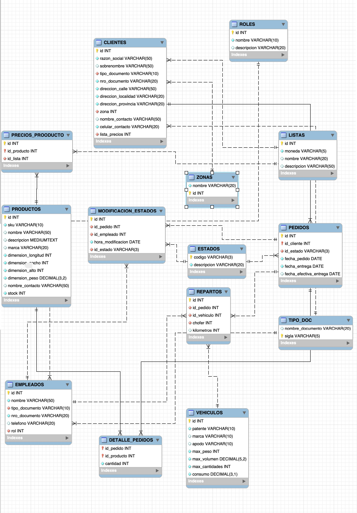

# PROYECTO CURSO SQL DE CODERHOUSE

Bienvenidos a "WINDWARD-APP", sistema de gestión online para una distribuidora mayorista (ficticia) de baterías para vehículos, que cuenta con una flota propia de camionetas para reparto.
Este proyecto trata de la base de datos, con sus procedimientos y funciones, para mejorar el sistema de órdenes de pedidos y logística de entrega. 

> [!NOTE]  
> El archivo de creación del schema y las tablas está dentro de la carpeta WindwardDB

## Objetivo

Diseñar una base de datos para la distribuidora, de manera que los clientes puedan realizar sus pedidos online, que reciban la confirmación de los mismos y se programe el día en que realizará la entrega en base al domicilio.

## Situación actual

Los clientes hacen los pedidos por whatsapp, un empleado pasa los pedidos a una planilla de excel y de la misma se hacen capturas de pantalla que se envían a los encargados de depósito, quienes arman los pedidos y los cargan en las camionetas de reparto. El recorrido de cada camioneta de reparto se organiza en forma manual, conociendo las zonas de ubicación de los clientes y en base a los días de reparto para cada zona. Si el volumen de reparto en un día / zona determinada es muy alto para ese día, se puede decidir no entregar todo en el mismo día, o hacer 2 circuitos, uno a la mañana y otro a la tarde.

### Problemas de la situación actual

- Los clientes no utilizan siempre el mismo lenguaje (o sea, cada uno usa un nombre distinto para un mismo producto) y muchas veces hay que volver a consultar qué producto es el que realmente quieren
- Los clientes no saben de antemano el valor de lo que están comprando, a no ser que ellos mismos hagan los cálculos conociendo los precios según la lista de precios que les toca.
- Una vez que los encargados de depósito comienzan a armar los pedidos, empiezan a evidenciarse los faltantes de stock, por lo que hay que volver a contactar a los clientes explicándoles la situación y ofreciéndoles opciones similares a las elegidas inicialmente
- El bloqueo de stock y consiguiente facturación / remisión a través del sistema ERM se realizan mientras se están armando los pedidos.
- Los empleados de depósito no tienen acceso directo a los pedidos, sino que es el empleado que toma los pedidos quien decide cuándo enviarles la información

### Solución propuesta

**Elaborar una app de gestión online (de la cual este proyecto consistirá sólo en la base de datos) que permita:**
- **A los clientes:** armar sus pedidos directamente y sin errores, conociendo los precios y el total de la compra al armar el carrito
- **A los empleados:** ver los pedidos directamente en la aplicación a medida que se van generando, y tener una hoja de ruta pre-armada por el sistema (la hoja de ruta se puede modificar por los administradores de la empresa, quienes son los que finalmente deciden qué clientes tienen prioridad en el caso de stock bajo de algún producto, o en el caso de que alguno de los vehículos o choferes no estén disponibles... o ante cualquier situación que pueda surgir)

**Con la APP**

- Los clientes tendrán acceso al sistema, en el que podrán elegir los productos y las cantidades (el stock de los productos estará cargado en el sistema).
- Una vez que el cliente armó su pedido, recibe confirmación del mismo y una orden de compra con el valor total de la misma. (Eventualmente se podría traer la información de las cuentas corrientes de los clientes, para que éstos sepan si tienen deudas y a cuánto ascenderá la misma sumando el nuevo pedido)
- Los encargados de depósito tendrán acceso al sistema y podrán ver los pedidos realizados y comenzar a armarlos (tal vez se requiera autorización de un gerente de distribución antes de que los encargados de depósito puedan tener el acceso a los pedidos.)
- El sistema distribuirá los pedidos por días y zonas de entrega y armará la posible logística de entrega
# Informes
A continuación se presentan algunos de los posibles informes generados con las tablas creadas para el proyecto. Los mismos son:
- Kilómetros/baterias: (en un periodo de tiempo determinado, que puede ser dia, semana o mes)
Se muestra el "rendimiento" del recorrido de cada vehiculo teniendo en cuenta los kilómetros andados. Se puede evaluar si conviene hacer muchos viajes cortos o uno largo
- Baterias/zona: para evaluar la zona con mas compras en un determinado periodo de tiempo
- Baterias/kilometro: (para cada cliente) para evaluar si conviene llevar las baterías a los clientes de más lejos, en funcion de las baterías que compra "por kilómetro". 
# A futuro
Hay gran cantidad de procedimientos nuevos y mejoras que se podrían sumar a la app de gestión. Algunos de ellos podrían ser:

- **STOCK:**
Cuando un producto determinado llega a un mínimo de stock, el sistema envía una alerta a los administradores.

- **GARANTÍAS:**
Los productos tienen garantía de 1 año y la gestión actual es muy "manual" y conlleva muchos errores: Los choferes reciben los productos que supuestamente están en garantía y los traen al depósito, donde se evalúa si corresponde o no la garantía. Si no corresponde, se devuelven; si corresponde, se almancenan hasta el momento de llevar a la fábrica. 
Todo ese proceso se guarda en tablas de excel y papeles, que podrían ser reemplazados por la app, de la siguiente manera:
  - El chofer ingresa en la app que recibió el producto en garantía
  - El encargado de depósito marca en la app si el producto es válido como garantía o si se devuelve
  - Si se devuelve, cuando el cliente que envió la garantía hace un nuevo pedido, el sistema avisa que hay una devolución pendiente y la carga automáticamente en el reparto
  - Si no se devuelve, se marca en la app los datos por lo que se aceptó la garantía, el cliente, la marca, etc y una vez que el cliente genera un nuevo pedido, el sistema agrega al pedido la garantia a reponer

# Tecnologías usadas
- Git: para control de versiones de los archivos
- Github: como repositorio de la rama principal y la rama de desarrollo
- Visual Studio Code: para escribir el código y manipular las ramas desde su terminal
- Miro: para el diagrama E-R 
- WorkBench: como gestor de base de datos
- Google sheets: para las tablas

# Esquema básico de prueba para la segunda entrega

Para probar lo hecho hasta ahora primero se deberán correr los archivos sql en la carpeta WindwardDB en el siguiente orden:
- schema.sql - contiene la generación de tablas
- datos.sql - carga los datos en las tablas
- procedures.sql - contiene los triggers, funciones y stored procedures
- functions.sql - contiene las funciones
- views.sql - contiene las vistas
- *snippets.sql* - con líneas de comando para probar todos los procesos y funciones

En cada archivo sql y antes de la definición de cada objeto o proceso, se puede ver la descripción de cada uno y las tablas que involucra.
### MANEJO DE ERRORES 
Importante: NO todos los procesos y funciones tienen programado un manejo de errores, por lo que si se prueban los procesos con claves incorrectas o datos no válidos, podría haber errores, no por el proceso en sí, sino por los datos de entrada.

# TABLAS

El siguiente enlace lleva a un archivo de google sheets con la definición de las tablas
https://docs.google.com/spreadsheets/d/1-eUCWY-VkGH3vUq4jT_UxRgGNy-ChXFRJeHKCe7AbH0/edit?usp=sharing

# DIAGRAMA ENTIDAD RELACION

La imagen que sigue muestra el diagrama, pero también se puede descargar un pdf de la lista de archivos y carpetas de este repo.

> [!NOTE]  
> En el dibujo la tabla vehículos no tiene los atributos de máximos, pero sí van, tal como aparecen en el archivo sql y la definición de tablas

# DIAGRAMA DE TABLAS - REVERSE ENGINEER

