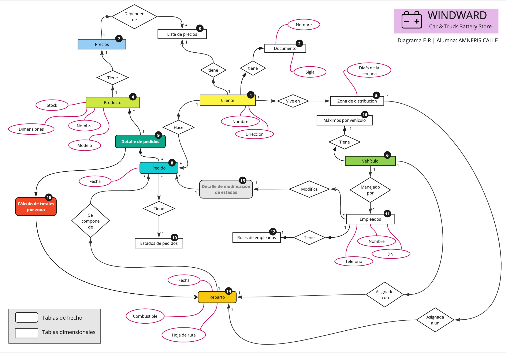
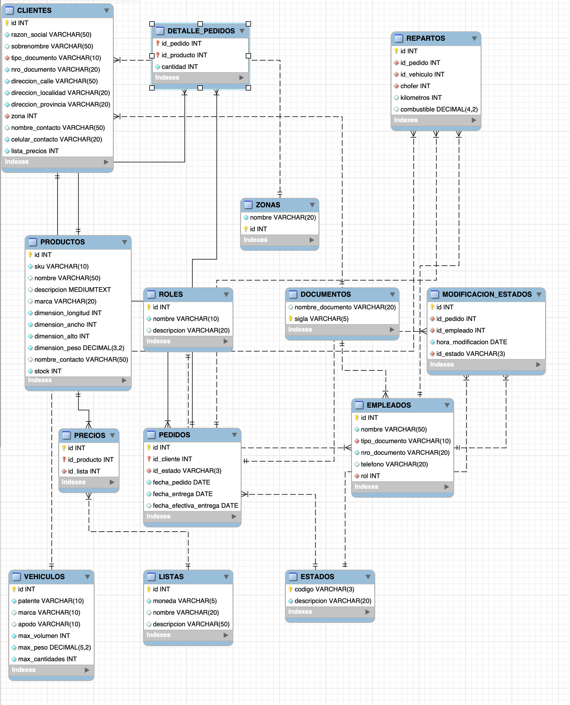

# PROYECTO CURSO SQL DE CODERHOUSE

> [!NOTE]  
> El archivo de creación del schema y las tablas está dentro de la carpeta WindwardDB

## Objetivo

Diseñar una base de datos para una distribuidora mayorista de productos (que tiene transporte propio para realizar las entregas en un radio de hasta 40 km), de manera que los clientes puedan realizar sus pedidos online, que reciban la confirmación de los mismos y se programe el día en que realizará la entrega en base al domicilio.

## Situación actual

Los clientes hacen los pedidos por whatsapp, un empleado pasa los pedidos a una planilla de excel y de la misma se hacen capturas de pantalla que se envían a los encargados de depósito, quienes arman los pedidos y los cargan en las camionetas de reparto. El recorrido de cada camioneta de reparto se organiza en forma manual, conociendo las zonas de ubicación de los clientes y en base a los días de reparto para cada zona. Si el volumen de reparto en un día / zona determinada es muy alto para un día determinado, se puede decidir no entregar en el mismo día.

### Problemas de la situación actual

- Los clientes no utilizan siempre el mismo lenguaje y muchas veces hay que volver a consultar qué producto es el que realmente quieren
- Los clientes no saben de antemano el valor de lo que están comprando, a no ser que ellos mismos hagan los cálculos conociendo los precios según la lista de precios que les toca.
- Una vez que los encargados de depósito empiezan a armar los pedidos, empiezan a evidenciarse los faltantes de stock, por lo que hay que volver a contactar a los clientes explicándoles la situación y ofreciéndoles opciones similares a las elegidas inicialmente
- El bloqueo de stock y consiguiente facturación / remisión a través del sistema ERM se realizan mientras se están armando los pedidos.
- Los empleados de depósito no tienen acceso directo a los pedidos, sino que es el empleado que toma los pedidos quien decide cuándo enviarles la información

### Solución propuesta

**Elaborar una app online (de la cual este proyecto consistirá sólo en la base de datos) que permita a los clientes armar sus pedidos directamente.**

- Los clientes tendrán acceso al sistema, en el que podrán elegir los productos y las cantidades (el stock de los productos estará cargado en el sistema).
- Una vez que el cliente armó su pedido, recibe confirmación del mismo y una orden de compra con el valor total de la misma. (Eventualmente se podría traer la información de las cuentas corrientes de los clientes, para que estos sepan si tienen deudas y a cuánto ascenderá la misma sumando el nuevo pedido)
- Los encargados de depósito tendrán acceso al sistema y podrán ver los pedidos realizados y comenzar a armarlos (tal vez se requiera autorización de un gerente de distribución antes de que los encargados de depósito puedan tener el acceso a los pedidos. Eso lo definiré a medida que avance el curso.)
- El sistema distribuirá los pedidos por días y zonas de entrega y armará la posible logística de entrega

# TABLAS

El siguiente enlace lleva a un archivo de google sheets con la definición de las tablas
https://docs.google.com/spreadsheets/d/1-eUCWY-VkGH3vUq4jT_UxRgGNy-ChXFRJeHKCe7AbH0/edit?usp=sharing


# DIAGRAMA ENTIDAD RELACION

La imagen que sigue muestra el diagrama, pero también se puede descargar un pdf de la lista de archivos y carpetas de este repo.

> [!NOTE]  
> En el dibujo la tabla vehículos no tiene los atributos de máximos, pero sí van, tal como aparecen en el archivo sql y la definición de tablas



# DIAGRAMA DE TABLAS - REVERSE ENGINEER



# Esquema básico de prueba para la segunda entrega

Para probar lo hecho hasta ahora primero se deberá correr el archivo index.sql, que genera el schema, los objetos y carga los datos. (Se pueden también hacer correr los archivos por separado, en el orden que sigue: schema, datos, procedures, views.)
En cada archivo sql y antes de la definición de cada objeto, se puede ver la descripción de cada uno y las tablas que involucra.
Una vez cargadas las vistas, funciones, triggers y stored procedures, se puede imitar el camino que seguría un cliente una vez que ingresa a la aplicación:
> [!NOTE]
> En los snippets de código que siguen, primero se deberá verificar que existan un cliente con id=15 y otro con id=14, porque los id se autogeneran. En mi caso, tengo los id usados, pero por favor verificar antes para que no den error.

1) Ver todos los productos que puede comprar con sus respectivos precios, en base a la lista de precios del cliente. Para esto se utiliza la vista **productos_con_precio**

```
SET @cliente = 14;
SELECT * FROM productos_con_precios WHERE lista = generar_variable_lista(@cliente);
```

2) Una vez elegidos los productos, el cliente enviará el formulario de compra con todos los datos de los productos y cantidades. Eso disparará el stored procedure **sp_generar_pedido**

```
CALL sp_generar_pedidos (15,'[{"producto":1,"cantidad":2},{"producto":2,"cantidad":10}]');
SELECT * FROM windward.pedidos_detallados;
```

El SP de generar pedidos inserta los registros en la tabla detalle de pedidos, pero ANTES dispara un trigger sp_verificar_stock, adjuntado a la tabla DETALLE_PEDIDOS, que verifica las cantidades en stock. Si hay menos productos de los que se piden, al pedido sólo se le suma la cantidad de stock existente.

3) Se puede ver el pedido con el detalle de productos y cantidades usando la vista **pedidos_detallados**

```
SET @cliente = 15;
SELECT * FROM pedidos_detallados WHERE id_cliente = @cliente;
```
4) En cuanto el encargado de depósito o la administración verifican las existencias de stock, pasan el estado de un pedido a APROBADO. En ese momento se dan debaja las unidades del stock que forman parte del pedido (este proceso se podría hacer cuando el cliente arma su pedido, para que un cliente que compra después vea el stock real, pero son decisiones de la lógica de cada negocio, que habría que evaluar en cada situación. En este caso el propósito del trabajo práctico es programar un stored procedure, y decidí hacerlo cuando se aprueba el pedido.)
```
CALL sp_aprobar_pedido (14)
```
