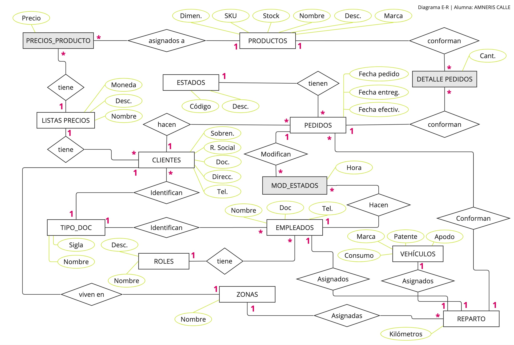

# PROYECTO CURSO SQL DE CODERHOUSE

Enlace al archivo con detalle de tablas

https://docs.google.com/spreadsheets/d/1-eUCWY-VkGH3vUq4jT_UxRgGNy-ChXFRJeHKCe7AbH0/edit?usp=sharing

## Objetivo

Diseñar una base de datos para una distribuidora mayorista de productos (que tiene transporte propio para realizar las entregas en un radio de hasta 40 km), de manera que los clientes puedan realizar sus pedidos online, que reciban la confirmación de los mismos y se programe el día en que realizará la entrega en base al domicilio.

## Situación actual

Los clientes hacen los pedidos por whatsapp, un empleado pasa los pedidos a una planilla de excel y de la misma se hacen capturas de pantalla que se envían a los encargados de depósito, quienes arman los pedidos y los cargan en las camionetas de reparto. El recorrido de cada camioneta de reparto se organiza en forma manual, conociendo las zonas de ubicación de los clientes y en base a los días de reparto para cada zona. Si el volumen de reparto en un día / zona determinada es muy alto para un día determinado, se puede decidir no entregar en el mismo día.

### Problemas de la situación actual

- Los clientes no utilizan siempre el mismo lenguaje y muchas veces hay que volver a consultar qué producto es el que realmente quieren
- Los clientes no saben de antemano el valor de lo que están comprando, a no ser que ellos mismos hagan los cálculos conociendo los precios según la lista de precios que les toca.
- Una vez que los encargados de depósito empiezan a armar los pedidos, empiezan a evidenciarse los faltantes de stock, por lo que hay que volver a contactar a los clientes explicándoles la situación y ofreciéndoles opciones similares a las elegidas inicialmente
- El bloqueo de stock y consiguiente facturación / remisión a través del sistema ERM se realizan mientras se están armando los pedidos.
- Los empleados de depósito no tienen acceso directo a los pedidos, sino que es el empleado que toma los pedidos quien decide cuándo enviarles la información

### Solución propuesta

**Elaborar una app online (de la cual este proyecto consistirá sólo en la base de datos) que permita a los clientes armar sus pedidos directamente.**

- Los clientes tendrán acceso al sistema, en el que podrán elegir los productos y las cantidades (que ya tendrán el stock cargado).
- Una vez que el cliente armó su pedido, recibe confirmación del mismo y una orden de compra con el valor total de la misma. (Eventualmente se podría traer la información de las cuentas corrientes de los clientes, para que estos sepan si tienen deudas y a cuánto ascenderá la misma sumando el nuevo pedido)
- Los encargados de depósito tendrán acceso al sistema y podrán ver los pedidos realizados y comenzar a armarlos (tal vez se requiera autorización de un gerente de distribución antes de que los encargados de depósito puedan tener el acceso a los pedidos)
- El sistema distribuirá los pedidos por días y zonas de entrega y armará la posible logística de entrega
- Hay algunos clientes que no están familiarizados con la tecnología moderna, en cuyo caso seguirán haciendo los pedidos por whatsapp, pero el empleado, en lugar de pasar el pedido al excel, lo pasará al sistema como si fuera el propio cliente

# TABLAS

El siguiente enlace lleva a un archivo de google sheets con la definición de las tablas
https://docs.google.com/spreadsheets/d/1-eUCWY-VkGH3vUq4jT_UxRgGNy-ChXFRJeHKCe7AbH0/edit?usp=sharing

# DIAGRAMA ENTIDAD RELACION

La imagen que sigue muestra el diagrama, pero también se puede descargar un pdf de la lista de archivos y carpetas de este repo.

# DIAGRAMA DE TABLAS - REVERSE ENGINEER

