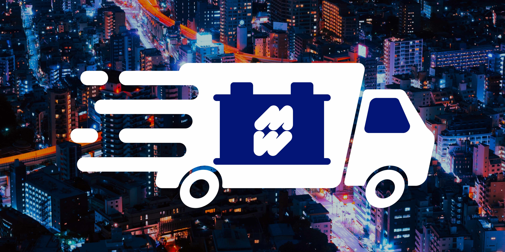

# PROYECTO CURSO SQL DE CODERHOUSE

Bienvenidos a "WINDWARD-APP", sistema de gestión online para una distribuidora mayorista (ficticia) de baterías para vehículos, que cuenta con una flota propia de camionetas para reparto.
Este proyecto trata de la base de datos, con sus procedimientos y funciones, para mejorar el sistema de órdenes de pedidos y logística de entrega. 

## Objetivo

Diseñar una base de datos para la distribuidora, de manera que los clientes puedan realizar sus pedidos online, que reciban la confirmación de los mismos y se programe el día en que realizará la entrega en base al domicilio.

## Situación actual

Los clientes hacen los pedidos por whatsapp, un empleado pasa los pedidos a una planilla de excel y de la misma se hacen capturas de pantalla que se envían a los encargados de depósito, quienes arman los pedidos y los cargan en las camionetas de reparto. El recorrido de cada camioneta de reparto se organiza en forma manual, conociendo las zonas de ubicación de los clientes y en base a los días de reparto para cada zona. Si el volumen de reparto en un día / zona determinada es muy alto para ese día, se puede decidir no entregar todo en el mismo día, o hacer 2 circuitos, uno a la mañana y otro a la tarde.

### Problemas de la situación actual

- Los clientes no utilizan siempre el mismo lenguaje (o sea, cada uno usa un nombre distinto para un mismo producto) y muchas veces hay que volver a consultar qué producto es el que realmente quieren
- Los clientes no saben de antemano el valor de lo que están comprando, a no ser que ellos mismos hagan los cálculos conociendo los precios según la lista de precios que les toca.
- Una vez que los encargados de depósito comienzan a armar los pedidos, empiezan a evidenciarse los faltantes de stock, por lo que hay que volver a contactar a los clientes explicándoles la situación y ofreciéndoles opciones similares a las elegidas inicialmente
- El bloqueo de stock y consiguiente facturación / remisión a través del sistema ERM se realizan mientras se están armando los pedidos.
- Los empleados de depósito no tienen acceso directo a los pedidos, sino que es el empleado que toma los pedidos quien decide cuándo enviarles la información

### Solución propuesta

**Elaborar una app de gestión online (de la cual este proyecto consistirá sólo en la base de datos) que permita:**

- **A los clientes:** armar sus pedidos directamente y sin errores, conociendo los precios y el total de la compra al armar el carrito
- **A los empleados:** ver los pedidos directamente en la aplicación a medida que se van generando, y tener una hoja de ruta pre-armada por el sistema (la hoja de ruta se puede modificar por los administradores de la empresa, quienes son los que finalmente deciden qué clientes tienen prioridad en el caso de stock bajo de algún producto, o en el caso de que alguno de los vehículos o choferes no estén disponibles... o ante cualquier situación que pueda surgir)

**Con la APP** :muscle:

- Los clientes tendrán acceso al sistema, en el que podrán elegir los productos y las cantidades (el stock de los productos estará cargado en el sistema).
- Una vez que el cliente armó su pedido, recibe confirmación del mismo y una orden de compra con el valor total de la misma. (Eventualmente se podría traer la información de las cuentas corrientes de los clientes, para que éstos sepan si tienen deudas y a cuánto ascenderá la misma sumando el nuevo pedido)
- Los encargados de depósito tendrán acceso al sistema y podrán ver los pedidos realizados y comenzar a armarlos (tal vez se requiera autorización de un gerente de distribución antes de que los encargados de depósito puedan tener el acceso a los pedidos.)
- El sistema distribuirá los pedidos por días y zonas de entrega y armará la posible logística de entrega
# Informes :chart_with_upwards_trend:
A continuación se presentan algunos de los posibles informes generados con las tablas creadas para el proyecto. Los mismos son:
- Totales - cantidades, pesos, volúmenes - por zona (se pueden filtrar por fecha)
- Kilómetros/baterias: (en un periodo de tiempo determinado, que puede ser dia, semana o mes)
Se muestra el "rendimiento" del recorrido de cada vehiculo teniendo en cuenta los kilómetros andados. Se puede evaluar si conviene hacer muchos viajes cortos o uno largo
- Baterias/zona: para evaluar la zona con mas compras en un determinado periodo de tiempo
- Baterias/kilometro: (para cada cliente) para evaluar si conviene llevar las baterías a los clientes de más lejos, en funcion de las baterías que compra "por kilómetro". 

Algunos de los informes se pueden ver en el siguiente enlace:
https://docs.google.com/spreadsheets/d/1acsjlpZ8HwZZbNozNAOFZt7q1ZIRVsGQrWouIJMt6YQ/edit?usp=sharing

# A futuro
En lo que al código actual se refiere, quedan por mejorar varios aspectos, entre ellos: 
- La generación de los repartos automáticamente para todas las zonas y la eventual división de un reparto en varios mas chicos, si es que el peso o las cantidades de una zona son mayores a las máximas por vehículo. 
- La asignación de un chofer por vehículo

Hay gran cantidad de procedimientos nuevos y mejoras que se podrían sumar a la app de gestión. Algunos de ellos podrían ser:
- **HOJA DE RUTA:**
Se podría generar una hoja de ruta de manera que el chofer siga el recorrido indicado en la misma, en lugar de que sea él mismo quien decida el orden en que tiene que ir haciendo las entregas.

- **STOCK:**
Cuando un producto determinado llega a un mínimo de stock, el sistema envía una alerta a los administradores.

- **ESTADOS DE CUENTA:**
Como se mencionó más arriba, se podría relacionar la app con el ERM para obtener el estado de cuenta de cada cliente de manera que, al momento de generar la orden, cada cliente pueda ver su cuenta corriente y conocer el saldo total (deuda más pedido nuevo).

- **GARANTÍAS:**
Los productos tienen garantía de 1 año y la gestión actual es muy "manual" y conlleva muchos errores: Los choferes reciben los productos que supuestamente están en garantía y los traen al depósito, donde se evalúa si corresponde o no la garantía. Si no corresponde, se devuelven; si corresponde, se almancenan hasta el momento de llevar a la fábrica. 
Todo ese proceso se guarda en tablas de excel y papeles, que podrían ser reemplazados por la app, de la siguiente manera:
  - El chofer ingresa en la app que recibió el producto en garantía;
  - El encargado de depósito marca en la app si el producto es válido como garantía o si se devuelve;
  - Si se devuelve, cuando el cliente que envió la garantía hace un nuevo pedido, el sistema avisa que hay una devolución pendiente y la carga automáticamente en el reparto;
  - Si no se devuelve, se marca en la app los datos por lo que se aceptó la garantía, el cliente, la marca, etc (datos que se guardan para el momento en que se envían las garantías a fábrica) y una vez que el cliente genera un nuevo pedido, el sistema agrega al pedido la garantia a reponer.

# Tecnologías usadas

 **Git:** para control de versiones de los archivos

 **Github:** como repositorio de la rama principal y la rama de desarrollo

 **Visual Studio Code:** para escribir el código y manipular las ramas desde su terminal

 **Miro:** para el diagrama E-R 

 **WorkBench:** como gestor de base de datos

 **Google sheets:** para la descripción de las tablas

... Lápiz y papel :sweat_smile:

# Esquema básico de evaluación del proyecto

> [!TIP]  
> Los scripts sql para probar el proyecto se encuentran en la carpeta WindwardDB y se deben correr en el siguiente orden:
> - schema.sql - contiene la generación y modificación de tablas
> - datos.sql - carga los datos en las tablas
> - procedures.sql - contiene los triggers, funciones y stored procedures
> - functions.sql - contiene las funciones
> - views.sql - contiene las vistas

Cada uno de los archivos de procedures, functions y views contiene la descripción del proceso, función o vista correspondiente, las tablas que involucran y lo que se quiere obtener.

### :teacher: Archivo *snippets.sql*
Este archivo contiene líneas de comando sugeridas para probar todos los procesos y funciones. Está dividido en líneas que ejecutan los procesos que seguiría un cliente, y líneas que ejecutan los procesos que utilizarían los administradores.

## Un día con la APP
Para entender a grandes rasgos la idea del funcionamiento de la app, a continuación se muestran los pasos que seguirían los clientes y administradores en un día cualquiera
1. El cliente mira el catálogo de productos (con el precio que le corresponde según su lista de precios) (Vista "productos_con_precio")
2. El cliente elige los productos y sus cantidades y arma el carrito de compras (Vista "pedidos_detallados")
3. El cliente envía la orden de pedidos (Procedure "sp_generar_pedidos")
4. El cliente ve su orden completa, con precios unitarios y el total (Vistas "pedidos_detallados" y "pedido_cliente")
5. El cliente (también lo puede hacer un administrador) modifica o borra su pedido completo (Procesos "sp_modificar_pedido" o "sp_borrar_pedido")
6. Los encargados de depósito modifican los estados de un pedido (dependiendo de si hay stock o no, cuando ya están cargados en los vehículos, etc - no programé todos los procesos de cambios de estado, sólo el de aprobado)
7. Los administradores pasan el estado de cada pedido a Aprobado (Proceso "sp_aprobar_pedido", que modifica el stock de los productos y permite que cada pedido sea considerado para su inclusion en los repartos)
8. Los administradores generan los repartos para cada zona, de manera que el sistema asigna un vehiculo a cada una (Proceso "sp_generar_reparto")
9. Los choferes ingresan el kilometraje al comienzo de cada reparto (Proceso "sp_cargar_km")
10. Una vez que el cliente recibe el pedido, los choferes pasan el estado del pedido a Entregado (proceso no programado)
11. Los choferes ingresan el kilometraje al final de cada reparto (Proceso "sp_cargar_km")

### MANEJO DE ERRORES 
Importante: NO todos los procesos y funciones tienen programado un manejo de errores, por lo que si se prueban los procesos con claves incorrectas o datos no válidos, podría haber errores, no por el proceso en sí, sino por los datos de entrada.

# TABLAS

El siguiente enlace lleva a un archivo de google sheets con la definición de las tablas
https://docs.google.com/spreadsheets/d/1-eUCWY-VkGH3vUq4jT_UxRgGNy-ChXFRJeHKCe7AbH0/edit?usp=sharing

# DIAGRAMA ENTIDAD RELACION

La imagen que sigue muestra el diagrama, pero también se puede descargar un pdf de la lista de archivos y carpetas de este repo.

> [!NOTE]  
> En el dibujo la tabla vehículos no tiene los atributos de máximos, pero sí van, tal como aparecen en el archivo sql y la definición de tablas

# DIAGRAMA DE TABLAS - REVERSE ENGINEER

